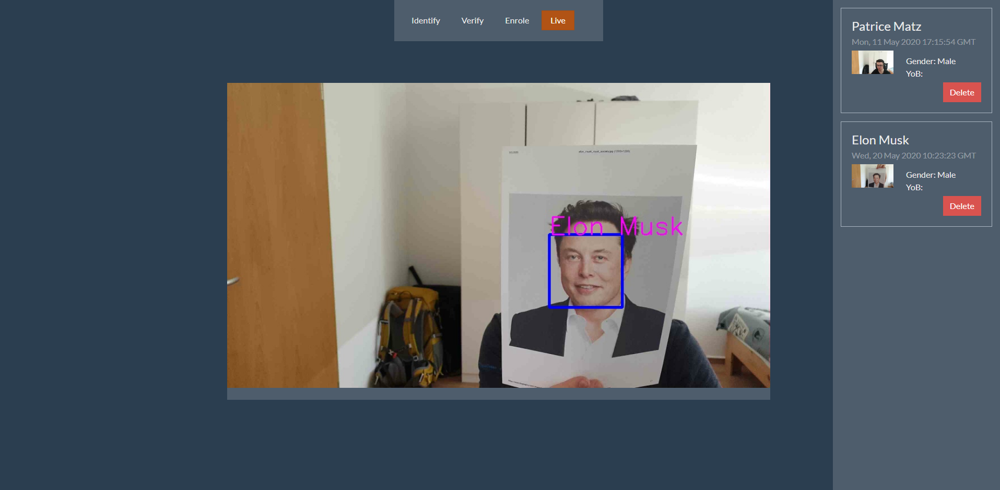
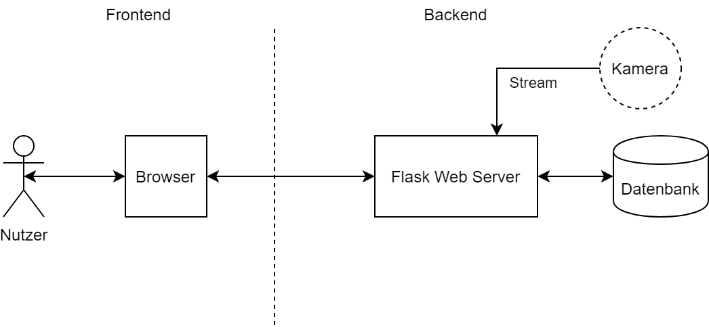
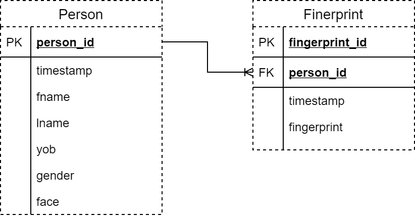

# Gesichtserkennung Demo

## Quick Start

In diesem Abschnitt finden Sie alle nötigen Informationen zum schnellen Deployen der Applikation.  

### Anforderungen

 - Python 3.x
 - pip (für Python 3)

### Deployment
#### ohne CUDA

    pip install -r requirements.txt
    python run.py

#### mit CUDA

    original stackOverflow Antwort: 
    https://stackoverflow.com/questions/49731346/compile-dlib-with-cuda/57592670#57592670

    Install Intel Performance Library: https://software.seek.intel.com/performance-libraries
    Install cuDNN: https://developer.nvidia.com/cudnn

    pip install cmake
    git clone https://github.com/davisking/dlib.git
    cd dlib
    git submodule init
    git submodule update
    mkdir build
    cd build
    cmake  -D DLIB_USE_CUDA=1 -D USE_AVX_INSTRUCTIONS=1 ../
    cmake --build . --config Release
    cd ../
    python setup.py install
    cd ../

    pip install -r requirements.txt
    python run.py

### Konfiguration

Die Konfigurationsdatei finden Sie im Ordner "application".  
In *./application/config.py* können Sie die relevanten Parameter konfigurieren.

    # Database config
    databaseFile    = "./test.sqlite"
    echoDatabase    = False

    # Web Server config
    debug           = True
    port            = '5001'

    # Face recognition config
    model           = "hog" # hog or cnn
    tolerance       = 0.6
    useCUDA         = True 
    videoSource     = "http://192.168.178.56:8080/video" 
    scaleInput      = 0.5

Video Source kann eine Videodatei, ein live stream oder eine Webcam sein:  
https://opencv-python-tutroals.readthedocs.io/en/latest/py_tutorials/py_gui/py_video_display/py_video_display.html#goal

**Nach dem erfolgreichen Deployment sollte es wie folgt aussehen:**

## Komponenten

Die Applikation nutzt Client seitiges rendern mit JS Templateing.   
Serverseitig wird nur die Grundlegende Struktur, das Gerüst sozusagen gerendert.

Das Backend besteht aus 3 Komponenten:
- Kamera
- Server
- Datenbank

**Komponentendiagramm:**

## API
Die API ist RESTful, besitzt 2 Endpoints mit dem Präfix */api/v1*.  

Struktur:

    /person/id?useFace
        POST:
            legt neues Person Objekt an
        GET:
            Parameter:
                id: URL Parameter, id des gesuchten Objektes, optional
                useFace: Query Parameter, letztes gespeicherte Bild wird zum identifizieren genutzt , optional

                    Get: wenn nur id gesetzt ist
                    Verifizierung: wenn id und useFace gesetzt sind 
                    Identifizierung: wenn useFace gesetzt ist 

        PUT:
            disabled
        DELETE:
            Löscht Objekt per ID

    /camera/type
        POST:
            speichert den aktuellen Frame
        GET:
            type - still (default): gibt letzten gespeicherten Frame
            type - stream: gibt einen mjpeg Video Stream aus, welcher als Bild eingebettet werden kann
            type - processed: mjpeg Video Stream mit umrandeten Gesichtern und eingezeichneten Namen
        PUT:
            disabled
        DELETE:
            disabled

## Datenstruktur  
Für den Datenbankzugriff wird der ORM SQLAlchemy genutzt.  
Es existieren Personen und Fingerabdrücke mit einer 1:N Beziehung.  
Fingerabdrücke werden momentan ignoriert.  

**Datenbankstruktur**
